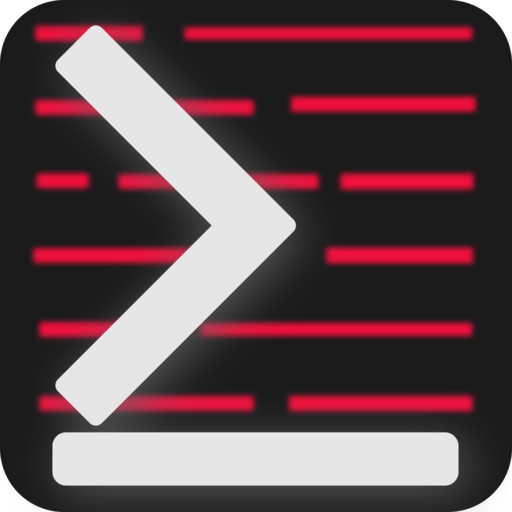

# quicknotes

**quicknotes** is a simple text based software for taking notes.

## WARNING

**This is a Work In Progress!**

quicknotes is just at its very early creation stage, it's not usable!

## Presentation



**quicknotes** is a very simple terminal app for notes management; you can create, edit, delete your notes, classify them into categories, attach tags to your notes, define templates for the creation of new notes, etc.

### Features

#### Notes

Create, edit, delete, read your notes

#### Categories

Create, edit, and delete your categories, list them, view the number of entries each of them contain, create a hierarchy with sub categories

#### Tags

Create, edit, and delete your tags; they are use to facilitate searching notes.

#### Read, Search, Export, Import

These features are self explanatory...

**TODO:** complete this section

## Installation

### Prerequesites

**TODO:** complete this section

### Building quicknotes

**TODO:** complete this section

### make install

**TODO:** complete this section

## Usage

**TODO:** complete this section

### Basic commands

**Create a note:**

```bash
quicknotes add note --name='My Note Title' --category='Various' --tags='example, new, note'

# or use the aliases and short options
qn a n -n 'My Note Title' -c 'Various' -t 'example, new, note'
```

**TODO:** complete this section

## Documentation

**TODO:** complete this section

## Contributing

**TODO:** complete this section
